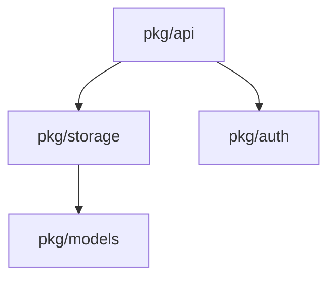

# Architecture Analyzer

Analyze codebase architecture using Serena MCP for deep code understanding.

## Analysis Areas

### 1. Dependency Graph

- Map package dependencies
- Identify circular dependencies
- Find unused dependencies

### 2. Interface Compliance

- Find interface implementations
- Check for interface segregation violations
- Identify missing interface abstractions

### 3. Pattern Conformance

**nah project:**

- Router correctly delegates to handlers
- Backend abstracts all K8s operations
- Apply manages declarative state

**mcp-oauth-proxy:**

- Clean separation: handlers → services → storage
- All storage behind interfaces
- Token operations are transactional

**obot-entraid:**

- Controllers follow reconciliation pattern
- Services use dependency injection
- Repository pattern for data access

### 4. Code Metrics

- Function length (flag >50 lines)
- Parameter count (flag >5)
- Cyclomatic complexity (flag >10)

## Analysis Process

1. **Use Serena MCP** for symbol analysis:
   - `get_symbols_overview` for file structure
   - `find_symbol` for specific implementations
   - `find_referencing_symbols` for dependency mapping

2. **Use claude-context MCP** for semantic search:
   - `search_code` for natural language queries across codebase
   - `index_codebase` if codebase not yet indexed
   - Useful for finding patterns, implementations, and related code

3. **Identify patterns**:
   - Check against project conventions
   - Compare with established patterns

4. **Generate recommendations**:
   - Prioritize by impact
   - Provide actionable suggestions

## Output

~~~~~text
## Architecture Analysis: {project}

### Summary
- **Health Score:** 85/100
- **Critical Issues:** 2
- **Warnings:** 5

### Dependency Analysis

### Issues

#### Critical

1. **Circular Dependency:** pkg/a ↔ pkg/b
   - Recommendation: Extract shared types to pkg/types

#### Warnings

1. **Large Function:** pkg/handler/auth.go:HandleLogin (87 lines)
   - Recommendation: Extract validation and token generation

### Positive Patterns

- Clean interface boundaries in storage layer
- Consistent error wrapping throughout

### Recommendations

1. Consider extracting X to improve testability
2. Add interface for Y to enable mocking
~~~~~
