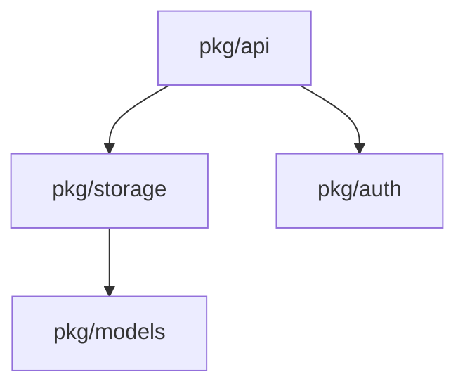

# Claude Code Enhancements Implementation Guide

Comprehensive guide for implementing advanced Claude Code features in the AI/MCP monorepo. Based on official Claude Code documentation (January 2026) and best practices research.

---

## Table of Contents

1. [Overview](#overview)
2. [Memory Management](#1-memory-management)
   - [CLAUDE.md Imports](#a-claudemd-imports)
   - [Path-Specific Rules](#b-path-specific-rules)
   - [Memory Hierarchy](#c-memory-hierarchy)
3. [Hooks Automation](#2-hooks-automation)
   - [Available Events](#available-hook-events)
   - [Configuration](#hooks-configuration)
   - [Recommended Hooks](#recommended-hooks-for-aimcp-monorepo)
4. [Custom Subagents](#3-custom-subagents)
   - [Agent Configuration](#agent-configuration)
   - [Recommended Agents](#recommended-agents)
5. [Custom Output Styles](#4-custom-output-styles)
6. [Skills Development](#5-skills-development)
7. [GitHub Actions Integration](#6-github-actions-integration)
8. [Plugin Development](#7-plugin-development)
9. [Implementation Checklist](#implementation-checklist)
10. [References](#references)

---

## Overview

### Current State

- AGENTS.md: Universal cross-agent guidelines (~2,500 tokens)
- CLAUDE.md: Claude-specific integration (~1,300 tokens)
- Serena MCP: Code intelligence with 8 memories
- Expert Mode: Optimized initialization command

### Enhancement Opportunities

| Category | Current | Enhanced |
| ---------- | --------- | ---------- |
| Memory | Single CLAUDE.md | Imports + path-specific rules |
| Automation | Manual validation | Hooks for auto-formatting |
| Agents | Built-in only | Custom domain-specific agents |
| CI/CD | No Claude integration | GitHub Actions PR review |
| Skills | SuperClaude only | Custom project skills |

### Priority Matrix

| Priority | Enhancement | Effort | Impact | Tokens |
| ---------- | ------------- | -------- | -------- | -------- |
| P0 | Path-specific rules | Low | High | Minimal |
| P0 | Auto-format hooks | Low | High | None |
| P1 | Pre-commit agent | Medium | High | ~200 |
| P1 | Go-reviewer agent | Medium | Medium | ~300 |
| P2 | GitHub Actions | Medium | High | None |
| P2 | Custom skills | Medium | Medium | Variable |
| P3 | Output styles | Low | Low | ~100 |
| P3 | Plugin packaging | High | Medium | None |

---

## 1. Memory Management

### A. CLAUDE.md Imports

The `@path/to/file` syntax allows modular instruction loading, reducing base context while enabling on-demand expansion.

#### Syntax

```markdown
# CLAUDE.md

Core instructions here...

@.claude/instructions/context-optimization-guide.md
@.claude/instructions/gptscript-development-guide.md
```

#### Import Rules

- Paths are relative to repository root
- Imports are processed recursively (imports can import)
- Circular imports are detected and prevented
- Missing files generate warnings, not errors

#### Recommended Import Structure

```text
CLAUDE.md (minimal, ~50 lines)
├── @.claude/instructions/context-optimization-guide.md
├── @.claude/instructions/documentation-standards.md
└── @.claude/instructions/gptscript-development-guide.md (conditional)
```

#### Implementation

**Refactored CLAUDE.md:**

~~~~~markdown
# CLAUDE.md

Claude Code-specific guidance. See `AGENTS.md` for universal guidelines.

## Serena MCP Integration

Activate before working:
```text
mcp__plugin_serena_serena__activate_project with project: "AI"
```

## Context Loading

@.claude/instructions/context-optimization-guide.md

## Project-Specific (Load On-Demand)

When working on GPTScript tools:
@.claude/instructions/gptscript-development-guide.md
~~~~~

#### Token Impact

- Before: ~1,300 tokens (full CLAUDE.md)
- After: ~400 tokens base + imports as needed
- Savings: Up to 70% reduction in base load

---

### B. Path-Specific Rules

Rules in `.claude/rules/*.md` automatically activate based on file glob patterns. This provides context-aware guidance without manual loading.

#### Directory Structure

```text
.claude/
└── rules/
    ├── go-tests.md          # *_test.go files
    ├── gptscript.md         # *.gpt files
    ├── svelte-components.md # *.svelte files
    ├── kubernetes.md        # pkg/controller/** files
    └── sql-migrations.md    # **/migrations/*.sql files
```

#### Rule Format

Each rule file should have YAML frontmatter followed by markdown content:

```yaml
globs: ["pattern1", "pattern2"]
alwaysApply: false
---
```

```markdown
# Rule Title

Rule content with specific guidance...
```

#### Frontmatter Options

| Field | Type | Description |
| ------- | ------ | ------------- |
| `globs` | string[] | File patterns to match (required) |
| `alwaysApply` | boolean | If true, applies to all files (default: false) |
| `description` | string | Optional description for rule discovery |

#### Recommended Rules

**1. Go Tests** (`.claude/rules/go-tests.md`)

~~~~~markdown
---
globs: ["**/*_test.go"]
description: Go test file conventions
---

# Go Test Conventions

## Required Patterns

1. **Table-Driven Tests**: Always use table-driven tests for multiple cases
   ```go
   tests := []struct {
       name    string
       input   Type
       want    Type
       wantErr bool
   }{...}
   ```

1. **Subtests**: Use `t.Run()` for each test case
   ```go
   for _, tt := range tests {
       t.Run(tt.name, func(t *testing.T) {...})
   }
   ```

2. **Test Naming**: `TestFunctionName_Scenario`

3. **Race Detection**: Consider `go test -race` for concurrent code

## Anti-Patterns

- Never use `t.Fatal()` in goroutines (use `t.Error()`)
- Never skip error checks in test setup
- Never hardcode test data paths (use `testdata/` directory)
~~~~~

**2. GPTScript** (`.claude/rules/gptscript.md`)

~~~~~markdown
---
globs: ["**/*.gpt", "**/tool.gpt"]
description: GPTScript tool definition format
---

# GPTScript Tool Format

## Required Fields

Every .gpt file MUST have:
- `Name:` - Tool identifier (PascalCase)
- `Description:` - What the tool does
- `Tools:` - Dependencies (built-in or external)

## Optional Fields

- `Credential:` - OAuth credential reference
- `Share Context:` - Context sharing with sub-tools
- `Param:` - Input parameters
- `Args:` - Positional arguments

## Template

```gpt
Name: MyTool
Description: Brief description of functionality
Credential: github.com/obot-platform/tools/oauth-credential as oauth
Share Context: github.com/obot-platform/tools/shared-context
Tools: sys.http.html2text, sys.download

#!{LANG}

Implementation code here...
```

## Credential Pattern

For OAuth-based tools:
```gpt
Credential: github.com/obot-platform/tools/oauth-credential as oauth with PROVIDER as env and "scope1 scope2" as scope
```

## Common Mistakes

- Missing `Name:` field (tool won't register)
- Wrong credential format (OAuth will fail)
- Missing `Tools:` for HTTP operations
~~~~~

**3. Svelte Components** (`.claude/rules/svelte-components.md`)

~~~~~markdown
---
globs: ["**/ui/**/*.svelte", "**/ui/**/*.ts"]
description: SvelteKit component conventions
---

# SvelteKit Conventions (obot-entraid)

## Component Structure

```svelte
<script lang="ts">
  // 1. Imports
  import { Component } from '$lib/components';

  // 2. Props (Svelte 5 runes)
  let { prop1, prop2 = 'default' } = $props<{
    prop1: string;
    prop2?: string;
  }>();

  // 3. State
  let state = $state(initialValue);

  // 4. Derived
  let derived = $derived(computation);

  // 5. Effects
  $effect(() => { ... });
</script>

<!-- Template -->
<div class="...">
  ...
</div>

<style>
  /* Scoped styles (prefer Tailwind) */
</style>
```

## File Organization

- `+page.svelte` - Route pages
- `+layout.svelte` - Layout wrappers
- `$lib/components/` - Reusable components
- `$lib/stores/` - Shared state

## Styling

- Use Tailwind CSS classes
- Avoid inline styles
- Use CSS variables for theming
~~~~~

**4. Kubernetes Controllers** (`.claude/rules/kubernetes.md`)

~~~~~markdown
---
globs: ["**/pkg/controller/**", "**/pkg/reconciler/**"]
description: Kubernetes controller patterns
---

# Kubernetes Controller Patterns

## Reconciliation Loop

```go
func (r *Reconciler) Reconcile(ctx context.Context, req ctrl.Request) (ctrl.Result, error) {
    // 1. Fetch the resource
    obj := &v1.MyResource{}
    if err := r.Get(ctx, req.NamespacedName, obj); err != nil {
        return ctrl.Result{}, client.IgnoreNotFound(err)
    }

    // 2. Check deletion
    if !obj.DeletionTimestamp.IsZero() {
        return r.handleDeletion(ctx, obj)
    }

    // 3. Add finalizer
    if !controllerutil.ContainsFinalizer(obj, finalizerName) {
        controllerutil.AddFinalizer(obj, finalizerName)
        return ctrl.Result{}, r.Update(ctx, obj)
    }

    // 4. Reconcile logic
    return r.reconcile(ctx, obj)
}
```

## Error Handling

- Return `ctrl.Result{}, err` for retryable errors
- Return `ctrl.Result{Requeue: true}` for explicit requeue
- Return `ctrl.Result{RequeueAfter: duration}` for delayed retry
- Return `ctrl.Result{}, nil` for success (no requeue)

## Status Updates

Always update status in a separate call:
```go
obj.Status.Conditions = append(obj.Status.Conditions, condition)
return ctrl.Result{}, r.Status().Update(ctx, obj)
```

## nah Framework

For nah-based controllers, use the Router/Backend/Apply pattern:
- Router: Orchestrates handlers
- Backend: Abstracts Kubernetes API
- Apply: Declarative resource management
~~~~~

**5. SQL Migrations** (`.claude/rules/sql-migrations.md`)

~~~~~markdown
---
globs: ["**/migrations/*.sql", "**/schema/*.sql"]
description: Database migration conventions
---

# SQL Migration Conventions

## Naming

Format: `YYYYMMDDHHMMSS_description.sql`
Example: `20260115143000_add_user_tokens_table.sql`

## Structure

```sql
-- Up migration
CREATE TABLE IF NOT EXISTS table_name (
    id BIGSERIAL PRIMARY KEY,
    created_at TIMESTAMP WITH TIME ZONE DEFAULT NOW(),
    updated_at TIMESTAMP WITH TIME ZONE DEFAULT NOW()
);

CREATE INDEX IF NOT EXISTS idx_table_column ON table_name(column);

-- Down migration (in separate file or comment block)
-- DROP TABLE IF EXISTS table_name;
```

## Best Practices

1. Always use `IF NOT EXISTS` / `IF EXISTS`
2. Add indexes for foreign keys and frequently queried columns
3. Use `TIMESTAMP WITH TIME ZONE` for timestamps
4. Include both up and down migrations
5. Test migrations on a copy of production data

## PostgreSQL Specifics

- Use `BIGSERIAL` for auto-increment IDs
- Use `JSONB` for JSON data (not `JSON`)
- Use `TEXT` instead of `VARCHAR` (no length limit in PG)
~~~~~

---

### C. Memory Hierarchy

Claude Code follows a strict precedence order for instructions:

```text
1. Enterprise Policy (highest priority)
   └── Managed by organization admins

2. Project Memory (CLAUDE.md)
   └── Repository root, auto-loaded

3. Project Rules (.claude/rules/*.md)
   └── Path-specific, auto-activated

4. User Memory (~/.claude/CLAUDE.md)
   └── Personal preferences

5. Local Project Overrides
   └── .claude/settings.local.json
```

#### Conflict Resolution

When instructions conflict:

1. Higher priority wins
2. More specific globs win over general
3. Later rules in same file win

---

## 2. Hooks Automation

Hooks are shell commands that execute at specific lifecycle events. They enable automation, validation, and integration with external tools.

### Available Hook Events

| Event | Trigger | Use Cases |
| ------- | --------- | ----------- |
| `PreToolUse` | Before tool execution | Block dangerous commands, validate inputs |
| `PostToolUse` | After tool execution | Auto-format, log changes, notifications |
| `Notification` | When Claude wants to notify | Desktop alerts, sound, integrations |
| `Stop` | End of response turn | Summarize changes, remind about commits |
| `SubagentStop` | Subagent completes | Aggregate results, chain tasks |
| `PreCompact` | Before context compaction | Save important context |
| `SessionStart` | New session begins | Load context, check prerequisites |
| `SessionEnd` | Session terminates | Cleanup, save state |

### Hooks Configuration

**Location:** `~/.claude/settings.json` (user) or `.claude/settings.json` (project)

**Schema:**

```json
{
  "hooks": {
    "EventName": [
      {
        "matcher": "regex pattern for tool name",
        "hooks": [
          {
            "type": "command",
            "command": "shell command to execute"
          }
        ]
      }
    ]
  }
}
```

### Environment Variables in Hooks

| Variable | Description | Available In |
| ---------- | ------------ | -------------- |
| `$CLAUDE_TOOL_NAME` | Current tool being used | PreToolUse, PostToolUse |
| `$CLAUDE_FILE_PATH` | File being operated on | Write, Edit, Read tools |
| `$CLAUDE_WORKING_DIRECTORY` | Current working directory | All events |
| `$CLAUDE_SESSION_ID` | Current session identifier | All events |

### Recommended Hooks for AI/MCP Monorepo

**Complete Configuration** (`.claude/settings.json`):

```json
{
  "hooks": {
    "PreToolUse": [
      {
        "matcher": "Bash",
        "hooks": [
          {
            "type": "command",
            "command": "echo \"$CLAUDE_TOOL_INPUT\" | grep -qE '(rm -rf /|git push.*--force.*main|git push.*--force.*master|DROP DATABASE|TRUNCATE)' && echo 'BLOCKED: Dangerous command detected' && exit 1 || exit 0"
          }
        ]
      }
    ],
    "PostToolUse": [
      {
        "matcher": "Write|Edit",
        "hooks": [
          {
            "type": "command",
            "command": "if [[ \"$CLAUDE_FILE_PATH\" == *.go ]] && command -v gofmt &>/dev/null; then gofmt -w \"$CLAUDE_FILE_PATH\" 2>/dev/null; fi"
          }
        ]
      },
      {
        "matcher": "Write|Edit",
        "hooks": [
          {
            "type": "command",
            "command": "echo \"$(date '+%Y-%m-%d %H:%M:%S') | $CLAUDE_TOOL_NAME | $CLAUDE_FILE_PATH\" >> ~/.claude/file-changes.log"
          }
        ]
      }
    ],
    "Stop": [
      {
        "hooks": [
          {
            "type": "command",
            "command": "cd \"$CLAUDE_WORKING_DIRECTORY\" && if git rev-parse --git-dir > /dev/null 2>&1; then CHANGES=$(git status --porcelain 2>/dev/null | wc -l | tr -d ' '); if [ \"$CHANGES\" -gt 0 ]; then echo \"\\n📝 $CHANGES uncommitted change(s). Run 'make validate-ci' before committing.\"; fi; fi"
          }
        ]
      }
    ],
    "SessionStart": [
      {
        "hooks": [
          {
            "type": "command",
            "command": "echo \"Session started: $(date '+%Y-%m-%d %H:%M:%S') in $CLAUDE_WORKING_DIRECTORY\" >> ~/.claude/sessions.log"
          }
        ]
      }
    ],
    "Notification": [
      {
        "hooks": [
          {
            "type": "command",
            "command": "command -v osascript &>/dev/null && osascript -e 'display notification \"$CLAUDE_NOTIFICATION\" with title \"Claude Code\"' || true"
          }
        ]
      }
    ]
  }
}
```

### Hook Behavior

**Exit Codes:**

- `0`: Success, continue execution
- Non-zero: For `PreToolUse`, blocks the operation
- Non-zero: For other events, logs warning but continues

**Output:**

- stdout: Displayed to user
- stderr: Logged as warning

**Timeout:**

- Default: 60 seconds
- Configurable per hook

---

## 3. Custom Subagents

Subagents are specialized AI assistants with isolated context and restricted tool access. They're ideal for focused tasks like code review, validation, or research.

### Agent Configuration

**Location:** `.claude/agents/agent-name.md`

**Frontmatter Schema:**

```yaml
---
name: agent-name              # Required: identifier
description: What this agent does  # Required: shown in /agents list
tools:                        # Optional: tool allowlist
  - Read
  - Glob
  - Grep
model: sonnet                 # Optional: sonnet, opus, haiku
allowedMcpServers:           # Optional: MCP server restrictions
  - serena
permissionMode: default       # Optional: default, strict, permissive
skills:                       # Optional: skill files to load
  - validate-project
hooks:                        # Optional: agent-specific hooks
  PreToolUse: [...]
---

Agent instructions here...
```

### Recommended Agents

**1. Go Code Reviewer** (`.claude/agents/go-reviewer.md`)

~~~~~markdown
---
name: go-reviewer
description: Reviews Go code for patterns, errors, and best practices in AI/MCP monorepo
tools:
  - Read
  - Glob
  - Grep
  - Task
model: sonnet
---

# Go Code Reviewer

You are a specialized Go code reviewer for the AI/MCP monorepo.

## Review Checklist

### Error Handling
- [ ] All errors are wrapped with context: `fmt.Errorf("action failed: %w", err)`
- [ ] No naked `return err` statements
- [ ] Errors at API boundaries have appropriate status codes

### Interface Design
- [ ] Interfaces are small and focused (1-3 methods ideal)
- [ ] Interface defined where used, not where implemented
- [ ] No "god interfaces" with many unrelated methods

### Concurrency
- [ ] Proper use of context.Context for cancellation
- [ ] No goroutine leaks (all goroutines have exit conditions)
- [ ] Mutex usage is minimal and documented
- [ ] Race conditions considered (check with `go test -race`)

### Testing
- [ ] Table-driven tests for multiple cases
- [ ] Edge cases covered (nil, empty, error conditions)
- [ ] No testing.T in goroutines (use testing.T.Run)

### Project-Specific Patterns

**nah controllers:**
- Router/Backend/Apply pattern followed
- Reconciliation is idempotent
- Status updates use `r.Status().Update()`

**mcp-oauth-proxy:**
- Tokens encrypted with AES-256-GCM
- PKCE flow implemented for public clients
- JWT validation includes all required claims

**obot-tools:**
- tool.gpt has required fields (Name, Description, Tools)
- Credentials properly declared
- Error responses are user-friendly

## Output Format

```markdown
## Review Summary

**Files Reviewed:** N
**Issues Found:** N (Critical: N, Warning: N, Info: N)

### Critical Issues
- file.go:123 - Description of issue
  - Suggested fix: ...

### Warnings
- ...

### Suggestions
- ...

### Positive Observations
- ...
```
~~~~~

**2. Pre-Commit Validator** (`.claude/agents/pre-commit.md`)

~~~~~markdown
---
name: pre-commit
description: Runs full pre-commit validation for current project, reports issues
tools:
  - Bash
  - Read
  - Glob
model: haiku
---

# Pre-Commit Validator

Validate the current project before committing changes.

## Detection

First, identify the project type:
1. Check for `go.mod` → Go project
2. Check for `package.json` in ui/ → Also has frontend
3. Check current directory name for project identification

## Validation Steps

### Go Projects

Execute in order, stop on first failure:

```bash
# 1. Generate code (if applicable)
if grep -q "go:generate" **/*.go 2>/dev/null; then
    go generate ./...
fi

# 2. Tidy dependencies
go mod tidy

# 3. Format code
go fmt ./...

# 4. Lint
if [ -f .golangci.yml ] || [ -f .golangci.yaml ]; then
    golangci-lint run
fi

# 5. Vet
go vet ./...

# 6. Test
go test -short ./...

# 7. Check for dirty repo (generated files)
if [ -n "$(git status --porcelain)" ]; then
    echo "ERROR: Uncommitted changes after generate/tidy"
    git status --short
    exit 1
fi
```

### Frontend (obot-entraid/ui/user)

```bash
cd ui/user
pnpm run ci  # Runs lint, format check, type check, test
```

## Output Format

```text
✅ Pre-commit validation PASSED

Steps completed:
1. ✓ go generate
2. ✓ go mod tidy
3. ✓ go fmt
4. ✓ golangci-lint
5. ✓ go vet
6. ✓ go test -short
7. ✓ Clean working directory

Ready to commit!
```

Or on failure:

```text
❌ Pre-commit validation FAILED

Step 4 (golangci-lint) failed:
  pkg/router/handler.go:45:12: error message here

Fix the issues and run validation again.
```
~~~~~

**3. GPTScript Validator** (`.claude/agents/gptscript-validator.md`)

~~~~~markdown
---
name: gptscript-validator
description: Validates GPTScript tool definitions for obot-tools
tools:
  - Read
  - Glob
  - Grep
model: haiku
---

# GPTScript Validator

Validate .gpt files in obot-tools for correctness.

## Required Fields Check

Every tool.gpt MUST have:
- `Name:` - Present and non-empty
- `Description:` - Present and descriptive (not just the name)
- `Tools:` - Present if tool makes HTTP calls or uses system features

## Credential Validation

If tool uses OAuth:
```gpt
Credential: github.com/obot-platform/tools/oauth-credential as oauth with PROVIDER as env and "scope1 scope2" as scope
```

Check:
- Provider matches directory name (google, microsoft, etc.)
- Scopes are appropriate for the tool's function
- Credential alias is used consistently in code

## Share Context Check

If tool needs to share data with sub-tools:
```gpt
Share Context: github.com/obot-platform/tools/shared-context
```

## Common Issues

1. **Missing Name field** - Tool won't register
2. **Missing Tools field** - HTTP calls will fail
3. **Wrong credential format** - OAuth will fail silently
4. **Inconsistent credential alias** - Runtime errors

## Output

```markdown
## GPTScript Validation Report

**Files Checked:** N
**Valid:** N
**Invalid:** N

### Issues Found

#### tool-name/tool.gpt
- Line 1: Missing `Name:` field
- Line 3: `Description:` is too short (< 10 chars)

### Warnings

#### other-tool/tool.gpt
- Uses `sys.http.html2text` but no error handling visible

### All Valid Tools
- provider-a/tool.gpt ✓
- provider-b/tool.gpt ✓
```
~~~~~

**4. Architecture Analyzer** (`.claude/agents/arch-analyzer.md`)

~~~~~markdown
---
name: arch-analyzer
description: Analyzes code architecture and suggests improvements
tools:
  - Read
  - Glob
  - Grep
  - Task
allowedMcpServers:
  - serena
model: sonnet
---

# Architecture Analyzer

Analyze codebase architecture using Serena MCP for deep code understanding.

## Analysis Areas

### 1. Dependency Graph
- Map package dependencies
- Identify circular dependencies
- Find unused dependencies

### 2. Interface Compliance
- Find interface implementations
- Check for interface segregation violations
- Identify missing interface abstractions

### 3. Pattern Conformance

**nah project:**
- Router correctly delegates to handlers
- Backend abstracts all K8s operations
- Apply manages declarative state

**mcp-oauth-proxy:**
- Clean separation: handlers → services → storage
- All storage behind interfaces
- Token operations are transactional

### 4. Code Metrics
- Function length (flag >50 lines)
- Parameter count (flag >5)
- Cyclomatic complexity (flag >10)

## Output

```markdown
## Architecture Analysis: {project}

### Summary
- **Health Score:** 85/100
- **Critical Issues:** 2
- **Warnings:** 5

### Dependency Analysis


### Issues

#### Critical
1. **Circular Dependency:** pkg/a ↔ pkg/b
   - Recommendation: Extract shared types to pkg/types

#### Warnings
1. **Large Function:** pkg/handler/auth.go:HandleLogin (87 lines)
   - Recommendation: Extract validation and token generation

### Positive Patterns
- Clean interface boundaries in storage layer
- Consistent error wrapping throughout
```
~~~~~

### Using Agents

**Invoke from CLI:**

```bash
# List available agents
claude /agents

# Run specific agent
claude "Review the changes in pkg/router" --agent go-reviewer

# Run in background
claude "Validate all .gpt files" --agent gptscript-validator --background
```

**Invoke from conversation:**

```text
Use the @go-reviewer agent to review my changes
```

---

## 4. Custom Output Styles

Output styles modify Claude's response format and communication style.

### Location

- User styles: `~/.claude/output-styles/`
- Project styles: `.claude/output-styles/`

### Style Format

```markdown
---
name: style-name
description: When to use this style
keep-coding-instructions: true
---

Instructions for how Claude should respond...
```

### Recommended Styles

**1. Minimal** (`.claude/output-styles/minimal.md`)

```markdown
---
name: minimal
description: Terse responses for experienced developers
keep-coding-instructions: true
---

# Minimal Output Style

Be extremely concise:
- No greetings or sign-offs
- No explanations unless asked
- Code over prose
- Show only relevant diffs
- One-line confirmations for simple tasks

Example response to "fix the typo":
```text
Fixed typo in pkg/router/handler.go:45
```

Not:

```text
I'll help you fix that typo. I found the issue in the router handler file...
[lengthy explanation]
The typo has been fixed. Let me know if you need anything else!
```

**2. Teaching** (`.claude/output-styles/teaching.md`)

```markdown
---
name: teaching
description: Educational mode explaining concepts and patterns
keep-coding-instructions: true
---

# Teaching Output Style

Optimize for learning:

1. **Explain the "why"** before showing code
2. **Show incorrect patterns** alongside correct ones
3. **Reference documentation** (link to CLAUDE.md, AGENTS.md)
4. **Use analogies** for complex concepts
5. **Summarize key takeaways** at the end

Structure responses as:
1. Concept explanation
2. Example in context
3. Common mistakes
4. Practice suggestions

Example teaching response structure:

    ## Error Wrapping in Go

    **Why it matters:** When errors bubble up through call stacks, context is lost...

    **Pattern:**
    // Good: Adds context
    return fmt.Errorf("failed to authenticate user %s: %w", userID, err)

    // Bad: Lost context
    return err

    **Key takeaway:** Always ask "will I know what failed when I see this in logs?"

**3. Debugging** (`.claude/output-styles/debugging.md`)

```markdown
---
name: debugging
description: Structured debugging assistance
keep-coding-instructions: true
---

# Debugging Output Style

Follow systematic debugging process:

## 1. Reproduce
- Confirm exact steps to reproduce
- Note environment details

## 2. Isolate
- Narrow down to specific component
- Identify last known good state

## 3. Analyze
- Form hypothesis
- Gather evidence (logs, state, traces)

## 4. Fix
- Make minimal change
- Verify fix doesn't introduce regressions

## 5. Prevent
- Add test case
- Document if non-obvious

Always structure debugging responses with these headers.
```

### Using Styles

```bash
# Set for session
claude --style minimal

# Set in config
claude config set preferredStyle minimal
```

---

## 5. Skills Development

Skills are reusable capabilities that can be invoked by model or user.

### Skill Structure

```text
.claude/skills/
└── skill-name/
    ├── SKILL.md       # Skill definition
    ├── scripts/       # Optional helper scripts
    └── templates/     # Optional templates
```

### SKILL.md Format

```markdown
---
name: skill-name
description: What this skill does
---

# Skill Title

Instructions for executing this skill...
```

### Recommended Skills

**1. Validate Project** (`.claude/skills/validate-project/SKILL.md`)

```markdown
---
name: validate-project
description: Run full CI validation for the current project directory
---

# Validate Project

Run complete pre-commit validation for the current project.

## Steps

1. **Detect Project Type**
   - Check for `go.mod` → Go project
   - Check for `package.json` in `ui/` → Frontend component

2. **Go Validation**
   ```bash
   go generate ./...
   go mod tidy
   go fmt ./...
   golangci-lint run
   go vet ./...
   go test -short ./...
   ```

1. **Frontend Validation** (if applicable)

   ```bash
   cd ui/user && pnpm run ci
   ```

2. **Clean Check**

   ```bash
   git status --porcelain
   ```

   - If output, warn about uncommitted changes

## Success Criteria

All commands must exit with code 0.

## Output

Report each step's status with ✓ or ✗.

**2. New Model Provider** (`.claude/skills/new-provider/SKILL.md`)

```markdown
---
name: new-provider
description: Scaffold a new model provider for obot-tools
---

# New Model Provider

Create a new model provider following established patterns.

## Prerequisites

- Provider name (e.g., "anthropic", "mistral")
- API base URL
- Authentication method (API key, OAuth)

## Steps

1. **Copy Template**
   ```bash
   cp -r obot-tools/openai-model-provider obot-tools/{name}-model-provider
   ```

1. **Update tool.gpt**
   - Change `Name:` to `{Name} Model Provider`
   - Update `Description:`
   - Update credential if different auth method

2. **Update Go Code**
   - Rename package
   - Update API endpoint
   - Adjust request/response mapping if API differs

3. **Update index.yaml**
   Add to `modelProviders:` section:

   ```yaml
   - name: {name}-model-provider
     description: {Name} model provider for Obot
     path: ./{name}-model-provider
   ```

4. **Test**

   ```bash
   cd obot-tools/{name}-model-provider
   export OBOT_{NAME}_MODEL_PROVIDER_API_KEY=...
   go run . validate
   ```

## Checklist

- [ ] tool.gpt has correct Name, Description, Tools
- [ ] Environment variable follows pattern: `OBOT_{NAME}_MODEL_PROVIDER_*`
- [ ] Implements OpenAI-compatible `/v1/chat/completions` endpoint
- [ ] Error responses are user-friendly
- [ ] Added to index.yaml
- [ ] Tested with `go run . validate`

**3. Document Component** (`.claude/skills/document-component/SKILL.md`)

```markdown
---
name: document-component
description: Generate documentation for a code component
---

# Document Component

Generate comprehensive documentation for a code component.

## Input

- Component path (file or directory)
- Documentation type: API, Architecture, Usage

## Process

1. **Analyze Code**
   - Read component source
   - Identify public API
   - Trace dependencies
   - Find usage examples in tests

2. **Generate Sections**

   **For API docs:**
   - Function signatures with types
   - Parameter descriptions
   - Return value descriptions
   - Error conditions
   - Examples

   **For Architecture docs:**
   - Component purpose
   - Design decisions
   - Data flow
   - Dependencies
   - Extension points

   **For Usage docs:**
   - Quick start
   - Common patterns
   - Configuration
   - Troubleshooting

3. **Format**
   - Use project documentation standards
   - Include code examples
   - Add diagrams where helpful (Mermaid)

## Output Location

- API: `docs/api/{component}.md`
- Architecture: `docs/architecture/{component}.md`
- Usage: `docs/guides/{component}.md`
```

---

## 6. GitHub Actions Integration

Automate Claude Code for PR reviews and issue triage.

### PR Review Workflow

**`.github/workflows/claude-review.yml`**

```yaml
name: Claude Code Review

on:
  pull_request:
    types: [opened, synchronize, reopened]
  issue_comment:
    types: [created]

# Only run on @claude mentions in comments, or automatically on PRs
jobs:
  review:
    if: |
      github.event_name == 'pull_request' ||
      (github.event_name == 'issue_comment' &&
       github.event.issue.pull_request &&
       contains(github.event.comment.body, '@claude'))

    runs-on: ubuntu-latest

    permissions:
      contents: read
      pull-requests: write
      issues: write

    steps:
      - name: Checkout
        uses: actions/checkout@v4
        with:
          fetch-depth: 0  # Full history for better context

      - name: Claude Code Review
        uses: anthropics/claude-code-action@v1
        with:
          anthropic_api_key: ${{ secrets.ANTHROPIC_API_KEY }}

          # Use cost-effective model for reviews
          model: claude-sonnet-4-20250514

          # Restrict to safe, read-only tools
          allowed_tools: |
            Read
            Glob
            Grep
            Task

          # Optional: Custom prompt
          prompt: |
            Review this PR focusing on:
            1. Code correctness and error handling
            2. Adherence to project patterns (see AGENTS.md)
            3. Test coverage for new code
            4. Security considerations

            Be concise. Only comment on significant issues.

          # Optional: Timeout (default 10 min)
          timeout_minutes: 15

      - name: Post Review Status
        if: always()
        uses: actions/github-script@v7
        with:
          script: |
            const status = '${{ job.status }}' === 'success' ? '✅' : '❌';
            console.log(`Claude review ${status}`);
```

### Issue Triage Workflow

**`.github/workflows/claude-triage.yml`**

```yaml
name: Claude Issue Triage

on:
  issues:
    types: [opened]
  issue_comment:
    types: [created]

jobs:
  triage:
    # Only on new issues or @claude mentions
    if: |
      github.event_name == 'issues' ||
      contains(github.event.comment.body, '@claude')

    runs-on: ubuntu-latest

    permissions:
      contents: read
      issues: write

    steps:
      - name: Checkout
        uses: actions/checkout@v4

      - name: Claude Triage
        uses: anthropics/claude-code-action@v1
        with:
          anthropic_api_key: ${{ secrets.ANTHROPIC_API_KEY }}
          model: claude-haiku-3-20250514  # Fast, cost-effective

          allowed_tools: |
            Read
            Glob
            Grep

          prompt: |
            Analyze this issue and:
            1. Identify which project it relates to (obot-entraid, nah, kinm, etc.)
            2. Suggest relevant labels
            3. If it's a bug, identify likely affected files
            4. If it's a feature request, note any architectural considerations

            Keep response under 200 words.
```

### Configuration Notes

**Secrets Required:**

- `ANTHROPIC_API_KEY` - API key for Claude

**For Enterprise (Bedrock/Vertex):**

```yaml
- uses: anthropics/claude-code-action@v1
  with:
    use_bedrock: true
    aws_region: us-east-1
    # Uses OIDC or AWS credentials from environment
```

**Tool Restrictions:**
For CI safety, restrict to read-only tools:

- `Read` - Read files
- `Glob` - Find files
- `Grep` - Search content
- `Task` - Spawn subagents (inherits restrictions)

Never allow in CI:

- `Write`, `Edit` - File modifications
- `Bash` - Arbitrary commands
- `WebFetch` - External requests

---

## 7. Plugin Development

Package enhancements as a reusable plugin for the organization.

### Plugin Structure

```text
.claude-plugin/
├── plugin.json          # Plugin manifest
├── agents/              # Custom agents
│   ├── go-reviewer.md
│   └── pre-commit.md
├── skills/              # Custom skills
│   └── validate-project/
│       └── SKILL.md
├── hooks/               # Hook configurations
│   └── hooks.json
├── rules/               # Path-specific rules
│   ├── go-tests.md
│   └── gptscript.md
└── output-styles/       # Custom styles
    └── minimal.md
```

### Plugin Manifest

**`.claude-plugin/plugin.json`**

```json
{
  "name": "ai-mcp-monorepo",
  "version": "1.0.0",
  "description": "Claude Code enhancements for AI/MCP monorepo development",
  "author": "AI Team",
  "license": "MIT",

  "components": {
    "agents": [
      "agents/go-reviewer.md",
      "agents/pre-commit.md",
      "agents/gptscript-validator.md",
      "agents/arch-analyzer.md"
    ],
    "skills": [
      "skills/validate-project",
      "skills/new-provider",
      "skills/document-component"
    ],
    "rules": [
      "rules/go-tests.md",
      "rules/gptscript.md",
      "rules/svelte-components.md",
      "rules/kubernetes.md"
    ],
    "outputStyles": [
      "output-styles/minimal.md",
      "output-styles/teaching.md"
    ],
    "hooks": "hooks/hooks.json"
  },

  "mcpServers": {
    "serena": {
      "command": "serena",
      "args": ["--project", "${CLAUDE_PLUGIN_ROOT}/../"]
    }
  },

  "settings": {
    "preferredModel": "sonnet",
    "preferredStyle": "minimal"
  }
}
```

### Plugin Installation

```bash
# Install from directory
claude plugin install ./path/to/.claude-plugin

# Install from git
claude plugin install https://github.com/org/repo.git

# List installed plugins
claude plugin list

# Update plugin
claude plugin update ai-mcp-monorepo
```

### Environment Variables

Plugins can access:

- `${CLAUDE_PLUGIN_ROOT}` - Plugin installation directory
- `${CLAUDE_PROJECT_ROOT}` - Current project root
- `${CLAUDE_CONFIG_DIR}` - Claude config directory

---

## Implementation Checklist

### Phase 1: Foundation (P0)

- [ ] **Create `.claude/rules/` directory**
  - [ ] `go-tests.md` - Go test conventions
  - [ ] `gptscript.md` - GPTScript format rules

- [ ] **Configure hooks** in `.claude/settings.json`
  - [ ] PostToolUse: Auto-format Go files
  - [ ] PreToolUse: Block dangerous commands
  - [ ] Stop: Remind about uncommitted changes

- [ ] **Test configuration**

  ```bash
  # Test rule activation
  claude "review this test file" # while editing *_test.go

  # Test hooks
  claude "create a simple Go file"  # should auto-format
  ```

### Phase 2: Agents (P1)

- [ ] **Create `.claude/agents/` directory**
  - [ ] `pre-commit.md` - Validation agent
  - [ ] `go-reviewer.md` - Code review agent

- [ ] **Test agents**

  ```bash
  claude /agents  # List available
  claude "validate my changes" --agent pre-commit
  ```

### Phase 3: CI/CD (P2)

- [ ] **Create GitHub Actions workflow**
  - [ ] `.github/workflows/claude-review.yml`
  - [ ] Add `ANTHROPIC_API_KEY` secret

- [ ] **Test workflow**
  - [ ] Create test PR
  - [ ] Verify review comments appear

### Phase 4: Advanced (P3)

- [ ] **CLAUDE.md imports** - Refactor for modularity
- [ ] **Custom output styles** - Create minimal, teaching
- [ ] **Plugin packaging** - Bundle for distribution
- [ ] **Custom skills** - validate-project, new-provider

---

## References

### Official Documentation

- [Claude Code Documentation](https://docs.anthropic.com/en/docs/claude-code)
- [Claude Code Hooks](https://docs.anthropic.com/en/docs/claude-code/hooks)
- [Claude Code Memory](https://docs.anthropic.com/en/docs/claude-code/memory)
- [Claude Code Subagents](https://docs.anthropic.com/en/docs/claude-code/sub-agents)
- [Claude Code GitHub Action](https://github.com/anthropics/claude-code-action)

### Project Documentation

- `AGENTS.md` - Universal AI agent guidelines
- `CLAUDE.md` - Claude-specific integration
- `.claude/instructions/context-optimization-guide.md` - Token optimization

### External Resources

- [AGENTS.md Open Standard](https://agents.md)
- [Claude Code Showcase](https://github.com/anthropics/claude-code-showcase)
- [Awesome Claude Code](https://github.com/community/awesome-claude-code)

---

*Document Version: 1.0.0*
*Last Updated: January 2026*
*Based on Claude Code documentation and best practices research*
