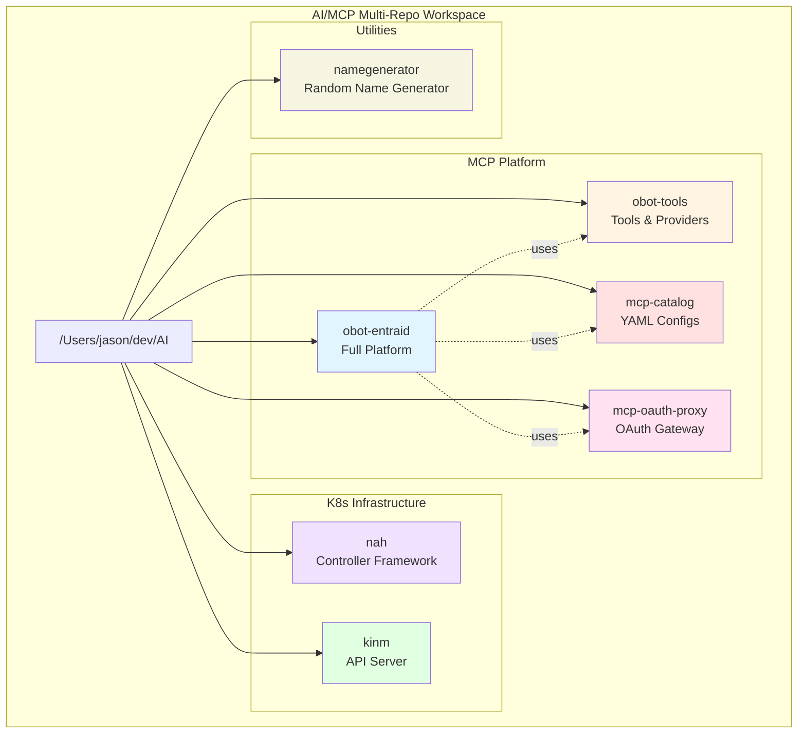
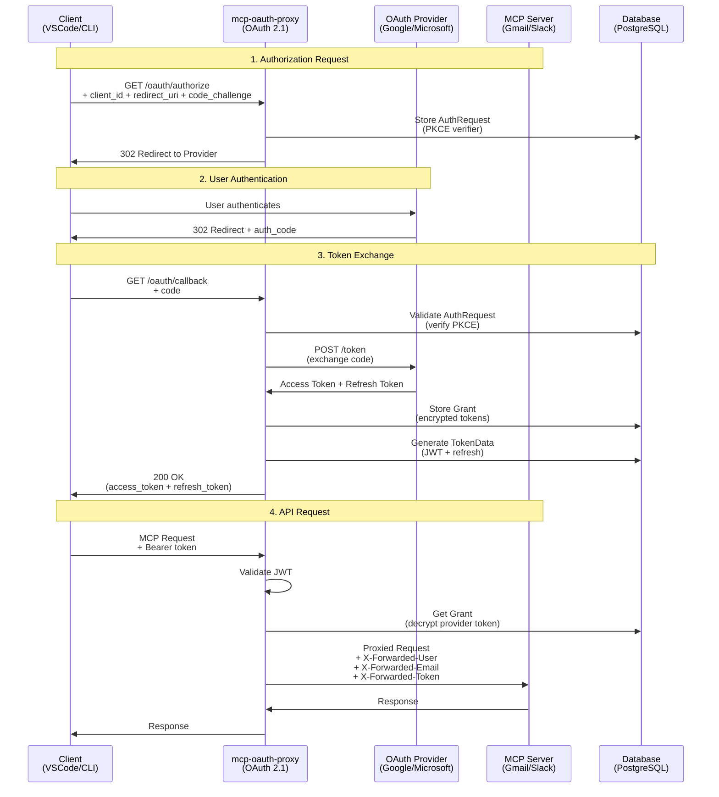
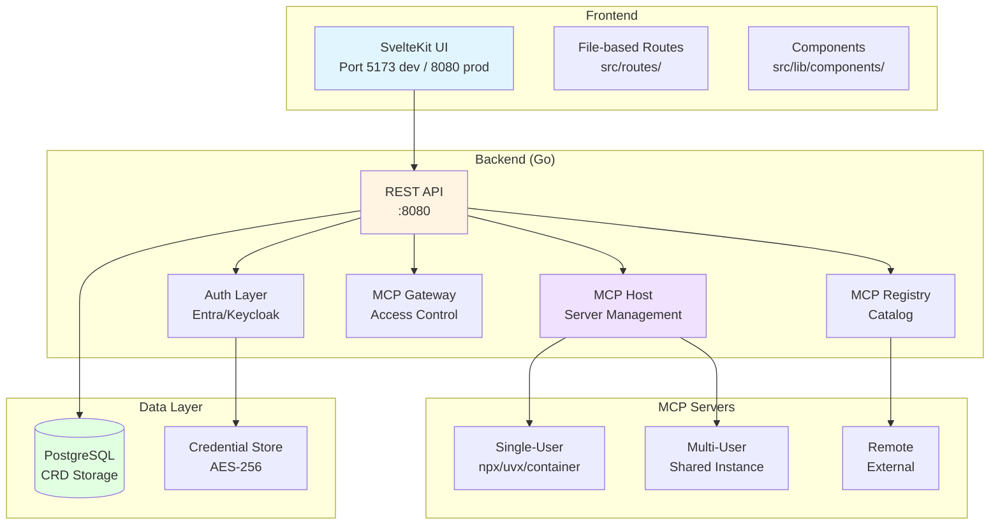
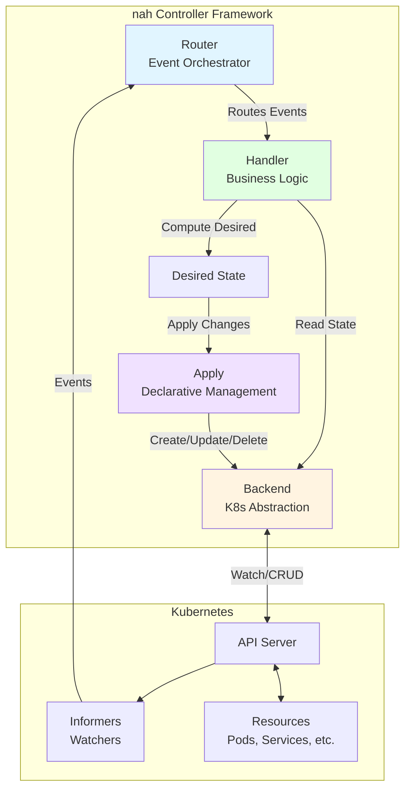
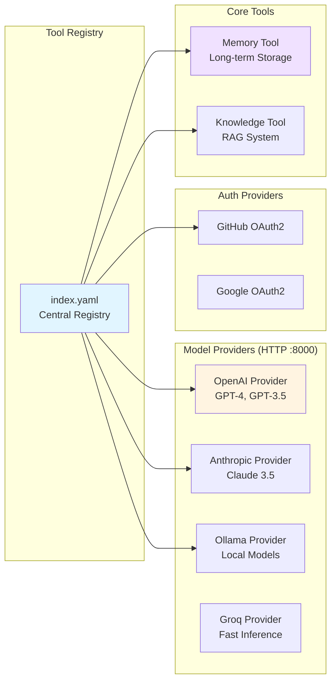
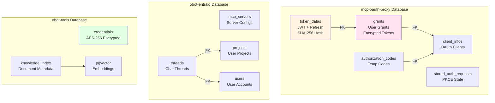
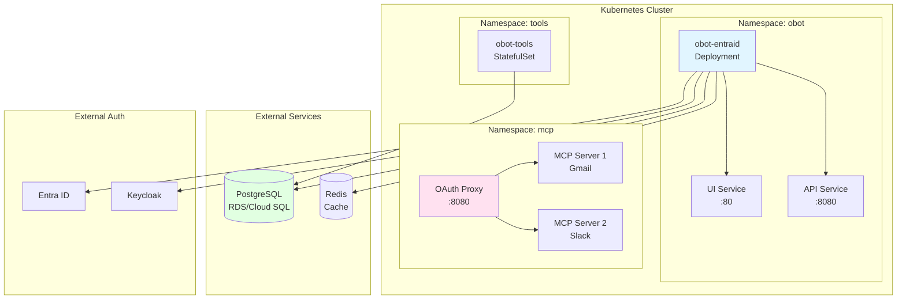
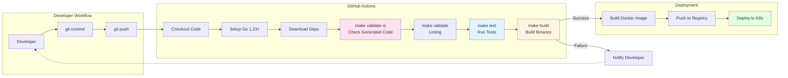
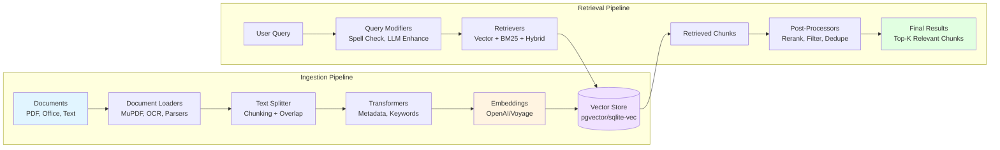

# Architecture Reference

**AI/MCP Multi-Repo Workspace** - Visual Architecture Diagrams
**Last Updated:** 2026-01-17

> **Formats:** This document contains both ASCII diagrams (universal) and Mermaid diagrams (interactive in GitHub/VS Code).

---

## Table of Contents

1. [Workspace Overview](#workspace-overview)
2. [Project Relationships](#project-relationships)
3. [Data Flows](#data-flows)
   - [OAuth 2.1 Flow](#oauth-21-flow-mcp-oauth-proxy)
   - [MCP Platform](#mcp-platform-obot-entraid)
4. [Component Architectures](#component-architectures)
   - [nah Controller Framework](#kubernetes-controller-pattern-nah)
   - [obot-tools](#obot-tools-architecture)
   - [kinm API Server](#kinm-api-server)
5. [Database Architecture](#database-architecture)
6. [Deployment Architecture](#deployment-architecture)
7. [Development Workflow](#development-workflow)
8. [Technology Stack](#technology-stack)
9. [Security Architecture](#security-architecture)
10. [Viewing Diagrams](#viewing-diagrams)

---

## Workspace Overview

### ASCII Diagram

```
┌─────────────────────────────────────────────────────────────────────┐
│                AI/MCP Multi-Repo Development Workspace              │
│                         /Users/jason/dev/AI                         │
└─────────────────────────────────────────────────────────────────────┘
                                   │
        ┌──────────────────────────┼───────────────────────────┐
        │                          │                           │
   ┌────▼────┐                 ┌───▼───┐                  ┌────▼────┐
   │  MCP    │                 │  K8s  │                  │  MCP    │
   │Platform │                 │ Tools │                  │Catalog  │
   └─────────┘                 └───────┘                  └─────────┘
        │                           │                         │
┌───────┼───────┐          ┌────────┼────────┐                │
│               │          │        │        │                │
▼               ▼          ▼        ▼        ▼                ▼
obot-entraid    obot-tools nah      kinm     mcp-oauth-proxy  mcp-catalog
(Platform)      (Tools)    (Lib)    (API)    (Proxy)          (Config)

                           Utilities
                              │
                              ▼
                        namegenerator
                          (Library)
```

### Mermaid Diagram



---

## Project Relationships

```
┌─────────────────────────────────────────────────────────────────┐
│                        Project Dependencies                     │
└─────────────────────────────────────────────────────────────────┘

obot-entraid ────uses───> obot-tools
      │                        │
      │                        ├─> Model Providers
      │                        ├─> Auth Providers
      │                        └─> Core Tools
      │
      └────uses───> mcp-oauth-proxy
                         │
                         └─> OAuth 2.1 Proxy

nah (framework)
      │
      ├─> Used by: Custom Controllers
      └─> Integrates: controller-runtime, client-go

kinm (API server)
      │
      └─> Standalone API Server

mcp-catalog (configs)
      │
      └─> Used by: obot-entraid, MCP clients

namegenerator (library)
      │
      └─> Standalone utility library for name generation
```

---

## Data Flows

### OAuth 2.1 Flow (mcp-oauth-proxy)

#### ASCII Diagram

```
┌──────────┐          ┌─────────────────┐         ┌────────────┐
│  Client  │          │ mcp-oauth-proxy │         │ MCP Server │
│ (VSCode) │          │  (OAuth 2.1)    │         │  (Gmail)   │
└─────┬────┘          └────────┬────────┘         └──────┬─────┘
      │                        │                         │
      │ 1. Request Access      │                         │
      ├───────────────────────>│                         │
      │                        │                         │
      │ 2. Redirect to OAuth   │                         │
      │<───────────────────────┤                         │
      │                        │                         │
      │ 3. Authenticate        │                         │
      ├────────> Google <──────┤                         │
      │                        │                         │
      │ 4. Auth Code           │                         │
      ├───────────────────────>│                         │
      │                        │                         │
      │ 5. Access Token        │                         │
      │<───────────────────────┤                         │
      │                        │                         │
      │ 6. MCP Request + Token │                         │
      ├───────────────────────>│                         │
      │                        │                         │
      │                        │ 7. Validate + Inject    │
      │                        │    Headers:             │
      │                        │    X-Forwarded-User     │
      │                        │    X-Forwarded-Email    │
      │                        │    X-Forwarded-Token    │
      │                        ├────────────────────────>│
      │                        │                         │
      │                        │ 8. MCP Response         │
      │                        │<────────────────────────┤
      │                        │                         │
      │ 9. Proxy Response      │                         │
      │<───────────────────────┤                         │
      └────────────────────────┴─────────────────────────┘
```

#### Mermaid Sequence Diagram



---

### MCP Platform (obot-entraid)

#### ASCII Diagram

```
┌─────────────────────────────────────────────────────────────┐
│                    obot-entraid Platform                    │
└─────────────────────────────────────────────────────────────┘
                              │
        ┌─────────────────────┼────────────────────┐
        │                     │                    │
   ┌────▼────┐          ┌─────▼─────┐         ┌────▼─────┐
   │Frontend │          │  Backend  │         │Auth Prvdr│
   │SvelteKit│          │    Go     │         │Entra/KC  │
   └────┬────┘          └─────┬─────┘         └─────┬────┘
        │                     │                     │
        │              ┌──────┼─────┐               │
        │              │      │     │               │
        │         ┌────▼─┐ ┌──▼──┐ ┌▼────┐          │
        │         │ MCP  │ │ MCP │ │ MCP │          │
        │         │ Host │ │ Reg │ │ Gate│          │
        │         └──┬───┘ └─────┘ └──┬──┘          │
        │            │                │             │
        └────────────┼────────────────┼─────────────┘
                     │                │
              ┌──────▼────────┐       │
              │ MCP Servers   │       │
              ├───────────────┤       │
              │ Node.js       │       │
              │ Python        │       │
              │ Containers    │       │
              └───────────────┘       │
                                      │
                            ┌─────────▼─────────┐
                            │   PostgreSQL      │
                            │   (State & Data)  │
                            └───────────────────┘
```

#### Mermaid Diagram



---

## Component Architectures

### Kubernetes Controller Pattern (nah)

#### ASCII Diagram

```
┌────────────────────────────────────────────────────────────┐
│                     nah Controller                         │
└────────────────────────────────────────────────────────────┘
                            │
            ┌───────────────┼───────────────┐
            │               │               │
      ┌─────▼─────┐    ┌────▼────┐    ┌─────▼─────┐
      │  Router   │    │ Backend │    │  Apply    │
      │  (Events) │    │  (K8s)  │    │  (State)  │
      └─────┬─────┘    └────┬────┘    └─────┬─────┘
            │               │               │
      ┌─────▼───────────────▼───────────────▼────┐
      │         Kubernetes API Server            │
      └──────────────────────────────────────────┘
                       │
          ┌────────────┼────────────┐
          │            │            │
     ┌────▼───┐   ┌───▼────┐  ┌─────▼────┐
     │  Pods  │   │Services│  │ConfigMaps│
     └────────┘   └────────┘  └──────────┘

Flow:
1. Watch: Backend watches K8s resources
2. Trigger: Changes trigger Router
3. Handle: Router calls registered handlers
4. Apply: Handler uses Apply for declarative updates
5. Reconcile: Apply creates/updates/deletes resources
```

#### Mermaid Diagram



---

### obot-tools Architecture

```
┌────────────────────────────────────────────────────────────┐
│                      obot-tools                            │
│                   Tool Registry (index.yaml)               │
└────────────────────────────────────────────────────────────┘
                              │
        ┌─────────────────────┼─────────────────────┐
        │                     │                     │
   ┌────▼────┐          ┌─────▼─────┐         ┌────▼────┐
   │  Core   │          │   Model   │         │  Auth   │
   │  Tools  │          │ Providers │         │Providers│
   └─────────┘          └───────────┘         └─────────┘
        │                     │                     │
    ┌───┼───┐          ┌──────┼──────┐        ┌────┼────┐
    │   │   │          │      │      │        │    │    │
    ▼   ▼   ▼          ▼      ▼      ▼        ▼    ▼    ▼
  Memory  Task      OpenAI Anthro Ollama   GitHub Google
  Know.   Files                Groq         OAuth  OAuth
  base              DeepSeek   xAI
                    Voyage
```



---

### kinm API Server

```
┌────────────────────────────────────────────┐
│          kinm API Server                   │
└────────────────────────────────────────────┘
                 │
      ┌──────────┼───────────┐
      │          │           │
 ┌────▼────┐ ┌───▼───┐ ┌─────▼─────┐
 │   API   │ │Storage│ │  Watch    │
 │  (REST) │ │ Layer │ │  Engine   │
 └────┬────┘ └───┬───┘ └─────┬─────┘
      │          │           │
      └──────────┼───────────┘
                 │
      ┌──────────▼──────────┐
      │    PostgreSQL       │
      │  (All State in DB)  │
      └─────────────────────┘

Features:
- Kubernetes-like REST API
- CRUD operations (Create, Read, Update, Delete)
- Watch support for real-time updates
- PostgreSQL for all state (no in-memory cache)
- Namespace support
- Label selectors

Endpoints:
- GET /api/v1/{resource_type}
- POST /api/v1/{resource_type}
- PUT /api/v1/{resource_type}/{name}
- PATCH /api/v1/{resource_type}/{name}
- DELETE /api/v1/{resource_type}/{name}
- GET /api/v1/{resource_type}?watch=true
```

---

## Database Architecture



---

## Deployment Architecture



---

## Development Workflow

```mermaid
graph TD
    Start([Start Development]) --> Choose{Choose<br/>Project}

    Choose --> |obot-entraid| OE[cd obot-entraid]
    Choose --> |nah| NAH[cd nah]
    Choose --> |kinm| KINM[cd kinm]
    Choose --> |others| Other[cd project]

    OE --> ReadDocs[Read CLAUDE.md<br/>& README.md]
    NAH --> ReadDocs
    KINM --> ReadDocs
    Other --> ReadDocs

    ReadDocs --> Setup[Setup<br/>go mod download<br/>go generate]

    Setup --> Branch[Create Branch<br/>git checkout -b feature/name]

    Branch --> Code[Write Code<br/>Add Tests<br/>Update Docs]

    Code --> Validate{Run Validation}

    Validate --> Gen[go generate]
    Gen --> Tidy[go mod tidy]
    Tidy --> Format[go fmt ./...]
    Format --> Lint[make validate]
    Lint --> Test[make test]
    Test --> CI[make validate-ci]

    CI --> |Pass| Commit[git commit -m<br/>"type: message"]
    CI --> |Fail| Code

    Commit --> Push[git push origin<br/>feature/name]

    Push --> PR[Create Pull Request]

    PR --> Review{Code Review}

    Review --> |Changes Requested| Code
    Review --> |Approved| Merge[Merge to Main]

    Merge --> End([Done])

    style Code fill:#e1f5ff
    style Validate fill:#fff4e1
    style CI fill:#f0e1ff
    style Merge fill:#e1ffe1
```

---

## Technology Stack

```
┌────────────────────────────────────────────────────────────┐
│                  Technology Layers                         │
└────────────────────────────────────────────────────────────┘

Frontend Layer
├── SvelteKit 5 (obot-entraid UI)
├── TypeScript
└── Tailwind CSS 4

Backend Layer
├── Go 1.23-1.25 (Primary)
├── Python 3.13+ (ML/AI tools)
└── TypeScript/Node.js 18+ (Image tools)

Framework Layer
├── controller-runtime 0.19 (K8s)
├── client-go 0.31 (K8s)
├── FastAPI (Python services)
└── GPTScript (Tool runtime)

Database Layer
├── PostgreSQL (Production)
└── SQLite (Development)

AI/ML Layer
├── OpenAI (GPT-4, embeddings)
├── Anthropic (Claude 3.5)
├── Ollama (Local models)
├── Groq, xAI, DeepSeek
└── Voyage (Embeddings)

Auth Layer
├── OAuth 2.0/2.1
├── PKCE
├── OIDC
└── AES-256 Encryption

Observability Layer
├── OpenTelemetry 1.35
├── logrus 1.9.3
└── Distributed tracing

Build & Deploy Layer
├── Make
├── Docker
├── Kubernetes
└── Helm
```

---

## Security Architecture

```
┌────────────────────────────────────────────────────────────┐
│                  Security Layers                           │
└────────────────────────────────────────────────────────────┘

Application Layer
├── OAuth 2.1 (mcp-oauth-proxy)
│   ├── PKCE for public clients
│   ├── Authorization code flow
│   └── Token refresh
│
├── Custom Auth Providers (obot-entraid)
│   ├── Entra ID (Microsoft)
│   ├── Keycloak (OIDC)
│   └── Profile picture support
│
└── Auth Providers (obot-tools)
    ├── GitHub OAuth2
    └── Google OAuth2

Data Layer
├── Encryption at Rest
│   ├── AES-256 for credentials
│   ├── Database-level encryption
│   └── Key management via env vars
│
└── Encryption in Transit
    ├── TLS for all HTTP traffic
    └── Secure WebSocket connections

Access Control
├── Token-based authentication
├── Session management
│   ├── Encrypted cookies
│   ├── Short-lived access tokens
│   └── Long-lived refresh tokens
│
└── Header injection
    ├── X-Forwarded-User
    ├── X-Forwarded-Email
    └── X-Forwarded-Access-Token

Secrets Management
├── Environment variables
├── Kubernetes Secrets
├── No hardcoded credentials
└── Secure token generation
```

---

## Additional Diagrams

### CI/CD Pipeline



### Knowledge Base RAG Pipeline (obot-tools)



---

## Viewing Diagrams

### In GitHub

Simply view this file on GitHub - Mermaid is natively supported.

### In VS Code

Install the "Markdown Preview Mermaid Support" extension:

```bash
code --install-extension bierner.markdown-mermaid
```

### Online Mermaid Editor

Copy and paste diagrams to: https://mermaid.live/

### Export as Images

Use Mermaid CLI:

```bash
npm install -g @mermaid-js/mermaid-cli
mmdc -i ARCHITECTURE.md -o diagrams.pdf
```

---

*Consolidated from ARCHITECTURE_DIAGRAM.md and MERMAID_DIAGRAMS.md. Contains both ASCII diagrams (universal) and Mermaid diagrams (interactive).*
